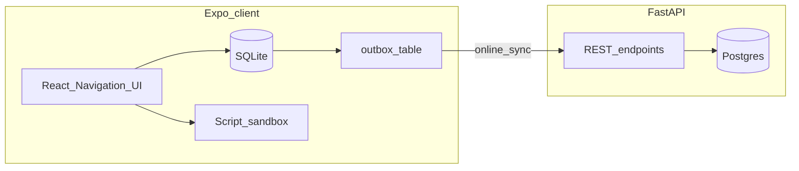

# Assistant Director

Assistant Director is a monorepo for an independent filmmaker companion app: it centralizes production planning on mobile while keeping a proper server database for durability, and it supports **offline-first** project data plus **screenplays that stay on-device only** — the API never stores screenplay bytes; the app validates and parses plain-text **`.txt` screenplays** (the Assistant Director template format) locally and caches them in sandbox storage for structured reading offline.

## Context and stack

| Area | Technology |
| :--- | :--- |
| Mobile | Expo SDK 54, React Native 0.81, TypeScript, React Navigation |
| Local persistence | SQLite (`expo-sqlite`) with an outbox for sync |
| API | Python 3.11+, FastAPI, SQLAlchemy 2, Alembic |
| Database | PostgreSQL 16 (Docker), port **5433** on the host to avoid colliding with a local Postgres on 5432 |
| Screenplays | Stored only on device (app sandbox + SQLite metadata); parsed with [`packages/sp-screenplay`](packages/sp-screenplay/) |

## Prerequisites

- Node.js LTS and npm
- Docker Desktop (or compatible) for PostgreSQL
- Python 3.11+ and `pip`
- Watchman (recommended on macOS for Metro)
- **Android development client only:** [Android Studio](https://developer.android.com/studio) with an SDK install, **`ANDROID_HOME`** (often `~/Library/Android/sdk` on macOS), and **`platform-tools`** on your **`PATH`** so `adb` runs in the terminal. See [Android: running the dev client](#android-running-the-dev-client-npm-run-devandroidfrontend) below.

## Quick start (under 10 minutes)

### 1. Clone and install JavaScript dependencies

```bash
git clone <your-remote-url> assistant-director
cd assistant-director
npm install
```

### 2. Start the backend (simplified)

**One command for first-time setup and startup:**
```bash
npm run backend:dev
```

**For subsequent runs (after initial setup):**
```bash
npm run backend:start
```

**Just the database:**
```bash
npm run backend:db
```

**Stop all backend services:**
```bash
npm run backend:stop
```

<details>
<summary>Manual backend setup (if you prefer step-by-step)</summary>

**Start PostgreSQL and apply migrations:**
```bash
docker compose up -d
cd backend
python3 -m venv .venv
source .venv/bin/activate
pip install -e .
cp .env.example .env
alembic upgrade head
```

**Run the API:**
```bash
cd backend
source .venv/bin/activate
uvicorn assistant_director_api.main:app --reload --host 0.0.0.0 --port 8000
```
</details>

**Verify the backend is running:**

```bash
curl -sS http://127.0.0.1:8000/health
```

### 3. Run the Expo app

The in-app alert **“Cannot reach the API”** (copy about `EXPO_PUBLIC_API_BASE_URL`) means the **client bundle has no API base URL** yet—it is not the same as “the backend is down.” If the URL is set but the server is stopped, **project sync** requests (outbox) will fail until the API is reachable.

Configure the API URL for the mobile client (required for **server sync** — screenplays do not need the network):

```bash
cp frontend/.env.example frontend/.env
# Edit frontend/.env and set EXPO_PUBLIC_API_BASE_URL for your setup (see comments in that file).
```

**Physical phone or tablet:** set `EXPO_PUBLIC_API_BASE_URL` to `http://<your-computer-LAN-IP>:8000` (not `127.0.0.1`). The API must be listening on `0.0.0.0` (see step 3) so the device can reach it. Restart Metro after editing `.env`, then reload the app.

### Expo Go, LAN HTTP, and development builds

**Expo Go** is a generic client from the App Store. It does **not** include this repo’s native settings from [`frontend/app.config.js`](frontend/app.config.js) (for example `NSAllowsLocalNetworking` on iOS and `usesCleartextTraffic` on Android). Plain **`http://` to your Mac’s LAN IP** therefore often fails from a real device with a generic **“Network request failed”** error, even when the URL is correct.

Pick **one** primary approach:

| Approach | When to use | What you do |
| :--- | :--- | :--- |
| **A. Development build** (recommended for device + local API) | You want `http://<LAN-IP>:8000` on a physical phone | Install native deps once, then from repo root run `npm run dev:ios:frontend` or `npm run dev:android:frontend` (or the same scripts inside `frontend/`). This builds a dev client that includes [`frontend/app.config.js`](frontend/app.config.js) networking flags. The [`frontend/app.json`](frontend/app.json) includes the `expo-dev-client` config plugin. After the first native build, start JS with `npm run start:frontend` and open the **Assistant Director** dev client (not Expo Go). |
| **B. Stay on Expo Go** | You do not want to compile native code yet | Expose the API over **HTTPS** with a hostname the phone can reach (for example **ngrok**, **Cloudflare Tunnel**, or a hosted staging API). Set `EXPO_PUBLIC_API_BASE_URL` to that **`https://...`** base URL and restart Metro. |

**Verify reachability before blaming the app:**

1. On the **phone’s browser** (Safari or Chrome), open `http://<LAN-IP>:8000/docs` (or `/health` from step 3). If that does not load, fix same Wi‑Fi, Mac firewall, and `uvicorn --host 0.0.0.0` first.
2. Confirm the Mac allows inbound connections on port **8000** if you use a firewall.
3. After changing `.env` or switching Expo Go vs dev client, **restart Metro** and fully reload the app.

You can instead (or additionally) put the same variable in a **`.env` file at the repository root**; Metro loads root `.env` first, then `frontend/.env` (the latter wins if both define the same key).

In a second terminal, from the repository root:

```bash
npm run start:frontend
```

Alternatively, without a `.env` file, export the variable once per shell before starting Metro (it must be present when the bundle is built):

```bash
export EXPO_PUBLIC_API_BASE_URL=http://127.0.0.1:8000
npm run start:frontend
```

On Android emulator, use `http://10.0.2.2:8000` instead of `127.0.0.1` so the device can reach the host. For a physical device, use your computer’s LAN IP. Restart Metro after changing this value.

Typecheck:

```bash
npm run typecheck:frontend
```

## Architecture



- **Projects** live in SQLite on device for fast lists and offline edits. Changes are appended to an **outbox** and pushed to `POST /v1/sync/push` when the network is available (last-write-wins using `updated_at`).
- **Screenplays (UTF-8 `.txt` using the template)** are **attached on device only**: text is validated and parsed in the app (via [`packages/sp-screenplay`](packages/sp-screenplay/), imported through a small adapter in [`frontend/src/features/scripts/parsing/`](frontend/src/features/scripts/parsing/)). Users can **choose a file, paste from the clipboard, or (on web) drag and drop** a `.txt` file. The server **never** receives screenplay content. **Another device** logged into the same account will **not** get a copy of the script automatically; only project/scene metadata syncs today.

## Repository layout

| Path | Role |
| :--- | :--- |
| [`frontend/`](frontend/) | Expo application |
| [`backend/`](backend/) | FastAPI service and Alembic migrations |
| [`packages/sp-screenplay-py/`](packages/sp-screenplay-py/) | Reference Python grammar and tests for `.txt` template screenplays (CI); not used by the API at runtime |
| [`packages/sp-screenplay/`](packages/sp-screenplay/) | Reusable TypeScript parser for the same template format (npm workspace) |
| [`docker-compose.yml`](docker-compose.yml) | PostgreSQL for local development |

## Configuration

- Backend: see [`backend/.env.example`](backend/.env.example) (never commit real secrets).
- Frontend: set `EXPO_PUBLIC_API_BASE_URL` to your API base URL. If unset, the app stays in a local-only mode with a fixed offline owner id and no sync. **Expo Go** with plain `http://` to a LAN machine is unreliable; see “Expo Go, LAN HTTP, and development builds” above.

## Common issues

- **Metro EMFILE / too many open files (macOS)** — install Watchman.
- **Dev build red screen: `NoSuchMethodError` in `expo.modules.crypto`** — an Expo module version does not match your SDK (for example `expo-crypto` for a newer SDK while the app is on SDK 54). From `frontend/`, run `npx expo install expo-crypto` (or align versions in [`frontend/package.json`](frontend/package.json)), then **`npm run dev:android:frontend`** / **`npm run dev:ios:frontend`** to rebuild the native client; a JS-only reload is not enough.
- **“Network request failed” during sync (physical device, Expo Go, `http://` LAN URL)** — Expo Go cannot rely on this project’s cleartext/ATS overrides. Use a **development build** (`npm run dev:ios:frontend` / `npm run dev:android:frontend`) or an **HTTPS** API URL. In-app errors prefixed with `USER_REGISTER_NETWORK:` indicate registration failures.
- **Cannot connect to API from a device** — use your machine LAN IP or `10.0.2.2` on Android emulator, not `localhost` from the phone’s point of view.
- **Postgres `role "assistant" does not exist` on port 5432** — another Postgres is using 5432. Use the provided Docker mapping on **5433** and the default `DATABASE_URL` in `.env.example`.
- **`expo run:android`: “No Android connected device found”** — you need a **running emulator** or a **USB-connected phone** with debugging enabled, and `adb devices` must list at least one line in state `device`. See [Android: running the dev client](#android-running-the-dev-client).

## Workspace commands

### Frontend Commands
| Command | Purpose |
| :--- | :--- |
| `npm run start:frontend` | Start Expo for the workspace package |
| `npm run dev:ios:frontend` | Build and run the iOS **development client** (native; first run is slow) |
| `npm run dev:android:frontend` | Build and run the Android **development client** |
| `npm run typecheck:frontend` | Run `tsc --noEmit` in `frontend/` |
| `npm run test:frontend` | Run Vitest in `frontend/` (pure TS + DOM-shimmed RN component smoke tests) |
| `npm run test:sp-screenplay` | Run Vitest for `@assistant-director/sp-screenplay` |

### Backend Commands
| Command | Purpose |
| :--- | :--- |
| `npm run backend:dev` | **One-command setup and start** (first time or after clean) |
| `npm run backend:start` | Start database and API server (after initial setup) |
| `npm run backend:setup` | Setup virtual environment, dependencies, and migrations |
| `npm run backend:db` | Start PostgreSQL database only |
| `npm run backend:stop` | Stop all backend services |
| `npm run backend:clear-projects` | Delete all projects in local Postgres (cascades scenes; keeps users) |
| `npm run test:backend` | Run `pytest` in [`backend/`](backend/) (requires `.venv` with dev tools: `pip install -e ".[dev]"` there; start `docker compose` / set `DATABASE_URL` for full API integration coverage) |

## CI/CD and deployment

### Continuous integration and deploy (GitHub Actions)

Workflow: [`.github/workflows/ci.yml`](.github/workflows/ci.yml) (**CI and Deploy**).

**On every pull request and push to `main`:**

1. **Frontend** – `npm ci` at the repo root, then `npm run typecheck:frontend`, `npm run test:frontend`, and `npm run test:sp-screenplay` (Vitest for [`packages/sp-screenplay`](packages/sp-screenplay/)).
2. **Backend** – Python 3.11, `pip install -e ".[dev]"` from [`backend/`](backend/), **Ruff**, **pytest** (Postgres 16 service container), **pytest** for [`packages/sp-screenplay-py`](packages/sp-screenplay-py/), and a smoke import of the FastAPI app.

**On push to `main` only** (after the jobs above succeed):

3. **Deploy backend (Render)** – POST to `RENDER_DEPLOY_HOOK_URL` to redeploy the Docker web service defined in [`render.yaml`](render.yaml) (Postgres + migrations via [`backend/Dockerfile`](backend/Dockerfile) `CMD` on each start).
4. **Deploy backend (GHCR)** – also builds and pushes `ghcr.io/<lowercase-github-owner>/assistant-director-api` (optional mirror for self-hosted Docker).
5. **Deploy frontend (EAS)** – runs `eas build --platform android --profile production` from [`frontend/`](frontend/) (Play Store–style **AAB**; see [`frontend/eas.json`](frontend/eas.json)). Track progress on [expo.dev](https://expo.dev).

You can also trigger a deploy manually: **Actions → CI and Deploy → Run workflow** (branch must be `main`).

Enable **branch protection** on `main` and require the test jobs to pass before merge.

#### Pre-commit hooks (catch failures before push)

Install [pre-commit](https://pre-commit.com/) once, then hooks run automatically on `git commit`:

```bash
pip install pre-commit
pre-commit install
```

Hooks mirror the fast CI checks (see [`.pre-commit-config.yaml`](.pre-commit-config.yaml)):

- **Ruff** on `backend/src` and `backend/tests` (same rule set as CI; fixes the unused-import class of failures)
- **TypeScript** typecheck when `frontend/` or `packages/sp-screenplay/` changes
- **Vitest** for frontend and screenplay package when relevant files change

Run every hook on the whole repo without committing:

```bash
pre-commit run --all-files
```

Hook environments use your system **Python 3.11+** (no fixed minor version in config). If pre-commit fails after a Python upgrade or config change, reset cached envs:

```bash
pre-commit clean
pre-commit install
pre-commit run --all-files
```

Backend **pytest** (Postgres integration tests) is not in pre-commit because it needs a database; CI still runs it on every PR.

#### Deploy API to Render (production host)

The live API runs on [Render](https://render.com) (managed Postgres + Docker web service), not on GitHub or Netlify.

**One-time setup:**

1. Sign in at [render.com](https://render.com) and connect this GitHub repository.
2. **New → Blueprint** → select the repo; Render reads [`render.yaml`](render.yaml) and creates `assistant-director-db` + `assistant-director-api`.
3. Wait for the first deploy to finish. Open the web service and note the public URL (e.g. `https://assistant-director-api.onrender.com`).
4. In Render → web service → **Environment**, set **`CORS_ALLOW_ORIGINS`** (comma-separated): your Render URL, `http://localhost:8081`, and any Netlify site URL you use.
5. Web service → **Settings → Deploy Hook** → copy the URL → GitHub secret **`RENDER_DEPLOY_HOOK_URL`**.
6. GitHub secret **`EXPO_PUBLIC_API_BASE_URL`** = your Render service URL (no trailing slash), e.g. `https://assistant-director-api.onrender.com`.

**Verify:**

```bash
curl -sS https://assistant-director-api.onrender.com/health
# {"status":"ok"}
```

**Free tier:** the service may spin down when idle; the first request after idle can take 30–60 seconds.

Render’s `DATABASE_URL` uses `postgresql://`; the API normalizes it to `postgresql+psycopg://` in [`backend/src/assistant_director_api/config.py`](backend/src/assistant_director_api/config.py) so Alembic and SQLAlchemy use psycopg3 (no manual env edit on Render).

Subsequent pushes to **`main`** run backend tests, then the workflow calls the deploy hook so Render rebuilds only after CI passes.

#### GitHub repository secrets

Configure under **Settings → Secrets and variables → Actions**:

| Secret | Required for | Notes |
| :--- | :--- | :--- |
| `RENDER_DEPLOY_HOOK_URL` | Render redeploy on `main` | From Render → service → Deploy Hook (after Blueprint first deploy) |
| `EXPO_TOKEN` | EAS production build | Create at [expo.dev](https://expo.dev) → Account → Access tokens |
| `EXPO_PUBLIC_API_BASE_URL` | Production mobile bundle | Your **Render** HTTPS base URL (no trailing slash). Baked in at EAS build time via [`frontend/app.config.js`](frontend/app.config.js) |

`GITHUB_TOKEN` is provided automatically for GHCR push.

If `RENDER_DEPLOY_HOOK_URL` is not set yet, the Render deploy job logs a skip message and exits successfully until you add the secret.

#### Android builds: APK vs AAB ([`frontend/eas.json`](frontend/eas.json))

| Profile | Output | Use |
| :--- | :--- | :--- |
| **`production`** | **AAB** | Google Play (`eas submit --platform android --profile production`). CI uses this on `main`. |
| **`preview`** | **APK** | Sideload or share with friends (install directly on device). |

**Download an APK from Expo:**

1. [expo.dev](https://expo.dev) → project → **Builds** → **Create build** → Android → profile **`preview`** (not `production`).
2. Or from `frontend/`: `EXPO_PUBLIC_API_BASE_URL=https://your-api.example.com eas build --platform android --profile preview`

Existing **production** builds on Expo remain **AAB**; start a new **preview** build to get an APK.

#### Run the API image from GHCR (self-hosted alternative)

For production, prefer **Render** (above). GHCR only stores the image; it does not run the API. On your own server:

```bash
# Example: pull and run with docker-compose.prod.yml
export API_IMAGE=ghcr.io/<your-github-owner-lowercase>/assistant-director-api:main
# Set DATABASE_URL, POSTGRES_PASSWORD, CORS_ALLOW_ORIGINS in .env.prod
docker compose -f docker-compose.prod.yml --env-file .env.prod up -d
docker compose -f docker-compose.prod.yml run --rm api alembic upgrade head
```

Make the package **public** or authenticate `docker login ghcr.io` on the server if the image is private.

### API container (Docker)

- **Image:** [`backend/Dockerfile`](backend/Dockerfile) – Python 3.11 slim, non-root user `app`, `uvicorn` on port **8000**. Build from the **repository root**: `docker build -f backend/Dockerfile .`
- **Runtime env:** set at deploy time (never commit secrets):
  - `DATABASE_URL` – Postgres DSN (same shape as [`backend/src/assistant_director_api/config.py`](backend/src/assistant_director_api/config.py)).
  - `CORS_ALLOW_ORIGINS` – comma-separated allow list; include your **Netlify** site URL and any Expo dev origins you use.

**Migrations:** the API image [`backend/Dockerfile`](backend/Dockerfile) runs `alembic upgrade head` before uvicorn on each container start (Render and docker compose). For ad-hoc runs: `docker compose -f docker-compose.prod.yml run --rm api alembic upgrade head`.

### Example production compose

[`docker-compose.prod.yml`](docker-compose.prod.yml) shows **Postgres + API** with env placeholders (`API_IMAGE`, `DATABASE_URL`, `POSTGRES_PASSWORD`, etc.). Copy values into a local `.env.prod` (gitignored) on the server.

### Netlify (static site)

The repo includes [`netlify.toml`](netlify.toml) and a minimal static site under [`site/`](site/) (landing copy only).

1. In Netlify: **Add new site → Import from Git**, select this repository.
2. Use defaults from `netlify.toml` (**publish directory:** `site`). No npm build is required unless you add one later.
3. Add your deployed **HTTPS** Netlify URL to the API’s `CORS_ALLOW_ORIGINS` and to the mobile client `EXPO_PUBLIC_API_BASE_URL` for production builds.

**Note:** Netlify serves static files here. The **FastAPI** app must run on a **Docker-capable** host (VM, Fly.io, Render, Railway, etc.); see Phase 3 in the internal CI/CD plan.

## Android: running the dev client

Use this when you run **`npm run dev:android:frontend`** (which invokes `expo run:android`).
`expo run:android` installs the native **development build** onto whatever **Android Debug Bridge (`adb`)** can see. If nothing is online, Expo reports **“No Android connected device found, and no emulators could be started automatically.”** That is not a bug in this repo’s npm scripts; you need a deployment target.

Official overview: [Run your app on an Android device emulator (Expo)](https://docs.expo.dev/workflow/android-studio-emulator/).

### 1. SDK and `adb`

1. Install **Android Studio** and open **SDK Manager** to install **Android SDK Platform-Tools** (includes `adb`).
2. Set **`ANDROID_HOME`** to your SDK root (Android Studio → **Settings → Languages & Frameworks → Android SDK** shows **Android SDK Location**). On many Macs this is `~/Library/Android/sdk`.
3. Add Platform-Tools to your **`PATH`** in the same shell you use for Expo, for example:
   ```bash
   export ANDROID_HOME="$HOME/Library/Android/sdk"
   export PATH="$PATH:$ANDROID_HOME/platform-tools"
   ```
4. Confirm: `adb version` works.

### 2. Start a target (emulator or device)

**Option A — Android Virtual Device (emulator)**

1. Android Studio → **Device Manager** → create a virtual device if needed → **Run** it and wait until the emulator home screen appears.
2. In a terminal: `adb devices` — you should see one serial with state **`device`** (not `offline` or `unauthorized`).

**Option B — Physical phone**

1. Enable **Developer options** and **USB debugging** ([device developer options](https://developer.android.com/studio/run/device.html#developer-device-options)).
2. Connect USB; accept the **Allow USB debugging** / RSA prompt on the phone.
3. `adb devices` should show your phone as **`device`**.

**Option C — Genymotion**

If you use Genymotion, set **Settings → ADB → Use custom Android SDK tools** and point it at the same **`ANDROID_HOME`** so there is a single `adb` and `adb devices` lists the VM.

### 3. Build and install

From the **repository root**, with `ANDROID_HOME` and `PATH` set in that terminal:

```bash
npm run dev:android:frontend
```

If `adb devices` is empty, or every line is `unauthorized`, fix SDK path and USB debugging before retrying.

## Further reading

- Backend runbook: [`backend/README.md`](backend/README.md)
